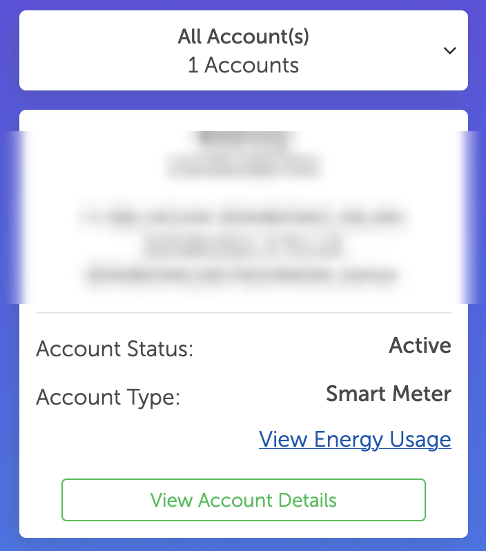
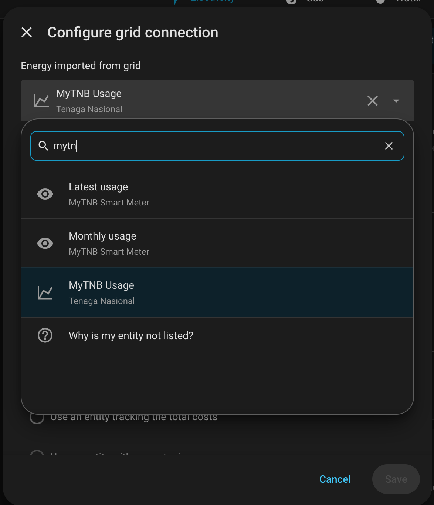
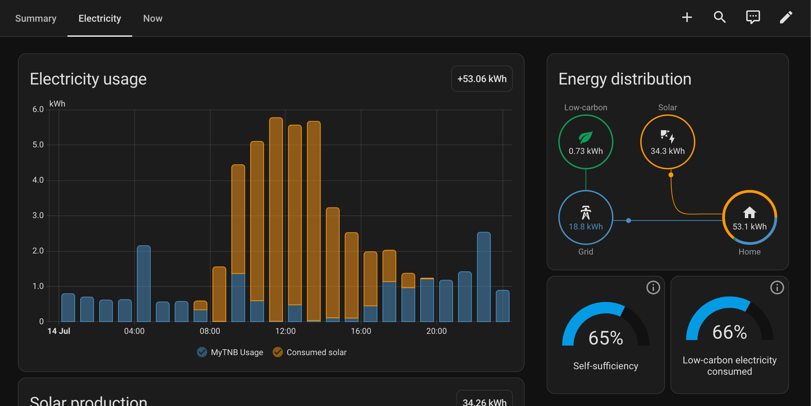
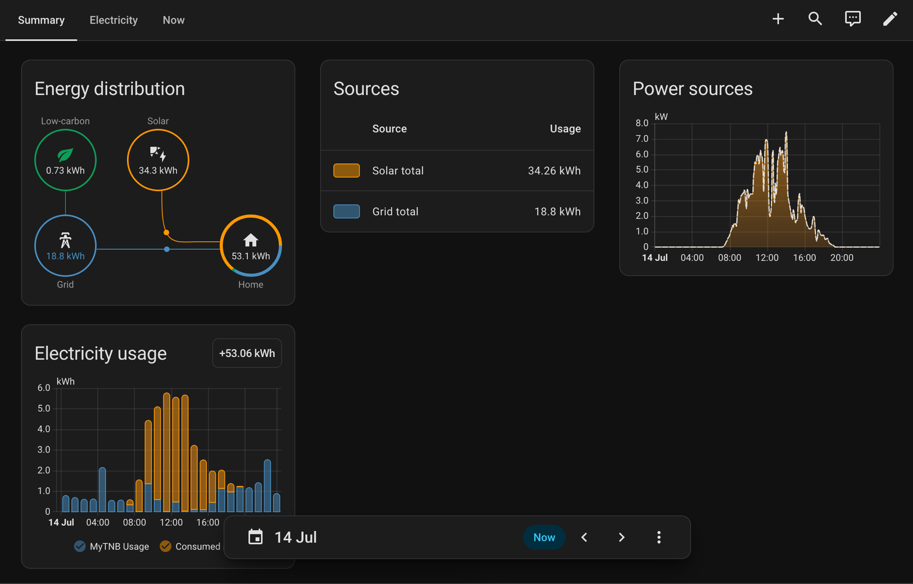

# MyTNB for Home Assistant

Custom integration for [Tenaga Nasional Berhad](https://www.mytnb.com.my/) smart meters.
It logs into the myTNB portal, reads 30-minute usage and daily cost data from the
smartliving dashboard, and feeds it into Home Assistant.

## Features

- **Sensors**: latest usage (kWh), latest cost (MYR), month-to-date usage and cost.
- **Energy dashboard**: hourly usage and cost are imported as external long-term
  statistics (`mytnb:usage_<meter>` / `mytnb:cost_<meter>`), correctly backdated —
  TNB publishes data roughly two days late, and the statistics are recorded at
  the time the energy was actually used.
- **Reauthentication flow**: if your password changes, Home Assistant prompts for
  the new one instead of failing silently.

## Installation

### HACS

1. HACS → Integrations → ⋮ → Custom repositories → add
   `https://github.com/feiming/homeassistant-MyTNB` as an **Integration**.
2. Search for "MyTNB" in HACS and install it.
3. Restart Home Assistant.

### Manual

1. Copy `custom_components/mytnb` into your Home Assistant `custom_components`
   directory.
2. Restart Home Assistant.

Then add the **Tenaga Nasional** integration via *Settings → Devices & Services*.

## Configuration

You will need:

- Your myTNB **email** and **password**.
- The **smart meter URL**: log into <https://myaccount.mytnb.com.my>, go to your
  account list, and look for **View Energy Usage** on the account with **Account
  Type: Smart Meter**. Copy the full URL — it contains
  `/AccountManagement/SmartMeter/Index/TRIL?caNo=...`.

  

## Energy dashboard setup

In *Settings → Dashboards → Energy*, add **Grid consumption** and pick the
`MyTNB Usage` statistic; use `MyTNB Cost` for "Use an entity tracking the total costs".



Once configured, hourly usage shows up alongside your other energy sources:




## How it works (and why it looks odd)

The TNB portal has no public API, so the integration replays the browser flow:
login → SSO handler → smart meter page → smartliving dashboard → commodity page
→ timeseries API. Two quirks are handled internally:

- The timeseries endpoint only answers a request made right after the matching
  commodity page was loaded; otherwise it replies with a redirect-to-login JSON
  even when the session is valid.
- Fresh sessions take a few seconds to propagate on TNB's side, so login-redirect
  responses are retried before the session is considered expired.

## Development

```
pip install -r requirements-test.txt
pytest
```

## License

[MIT](LICENSE)
